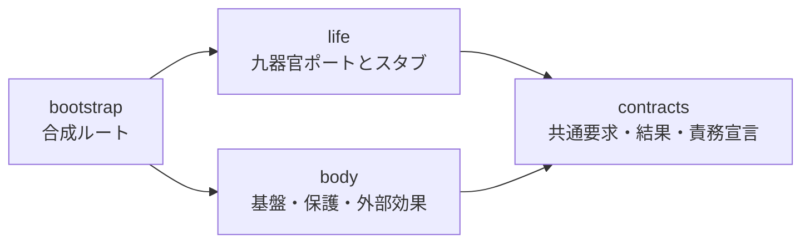

# Yamicha 責務骨格 Version 0.1

本書は、実装ロードマップ段階1における、論理責務とコード上の境界の対応を記録する。

## 1. 責務対応表

| 論理責務 | 識別子 | コード上のポート | 所有するもの | 禁止するもの |
|---|---|---|---|---|
| 核 | `core` | `CorePort` | 循環の相関、取り回し、統合状態 | 候補作成、他器官内部処理の所有、直接実行 |
| 記憶 | `memory` | `MemoryPort` | 記憶、意味、由来、保持状態 | 最終判断、現在状態の代行、外部実行 |
| 状態 | `state` | `StatePort` | 現在状態、遷移、内部時間 | 長期記憶、最終判断、人格演出 |
| 感覚 | `sensation` | `SensationPort` | 直接受領事象、出所、受領時刻、品質 | 意味・意図・行動の決定 |
| 判断 | `judgment` | `JudgmentPort` | 選択肢、選択案、理由、不確実性 | 最終確定、直接実行、直接表現 |
| 関係 | `relationship` | `RelationshipPort` | 相手、合意、距離、継続文脈 | 全記録所有、外部実行、境界解除 |
| 能力 | `capability` | `CapabilityPort` | 能力契約、実行状態、外部結果 | 方向決定、自律開始、直接発話 |
| 言葉 | `language` | `LanguagePort` | 表現成果、語調、長さ、根拠対応 | 方針変更、能力実行、事実創作 |
| 補助知能 | `auxiliary_intelligence` | `AuxiliaryIntelligencePort` | 利用文脈、問合せ、結果、制約 | 主体化、判断独占、結果の直結 |
| 基盤 | `runtime` | `RuntimePort` | プロセス、技術時間、配送、技術ログ | 判断提案、最終確定、器官情報の変更 |
| 保護境界 | `protection_boundary` | `ProtectionBoundaryPort` | 検証結果、保護状態、固定条件証拠 | 主体化、判断提案、単独解除 |
| 外部効果ゲート | `external_effect_gate` | `ExternalEffectGatePort` | 許可検査結果、承認証跡、監査 | 行動選択、権限付与、能力代行 |

コード上の宣言は `ResponsibilityDefinition` に入力、出力、所有情報、禁止事項および権限を保持する。記述とコードが不一致になった場合は、上位文書を基準として同時に修正する。

## 2. 依存関係

- `life` と `body` は互いを直接参照しない。
- 両者の接続は、共通契約を使って `bootstrap` だけが行う。
- 外部接続は将来 `adapters` に置き、九器官へ直接接続しない。
- ディレクトリやクラス単体をYamichaの主体として扱わない。全責務が時間の中で協調する全体を主体として扱う。

## 3. 段階1の境界

各スタブは呼び出された場合に `UnimplementedResponsibilityError` を返す。これは、段階1で具体的な判断、表現、外部実行または生命循環を暗黙に実装しないためである。
